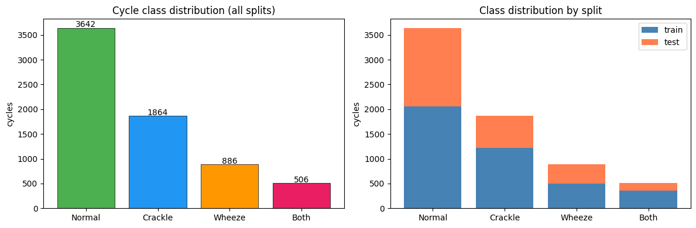
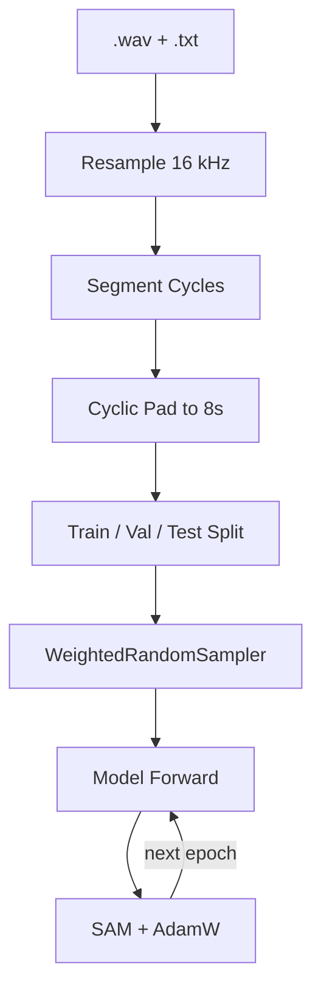
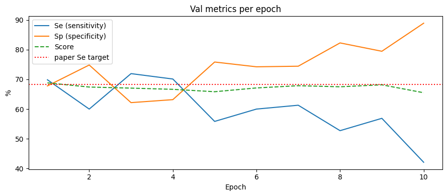
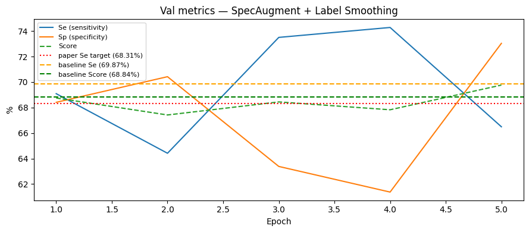
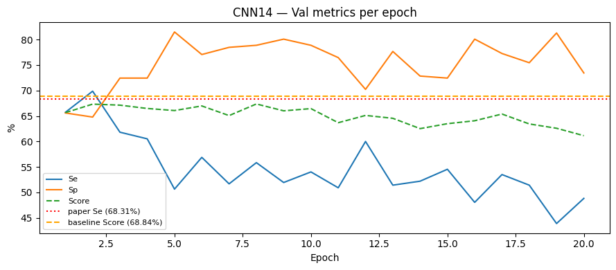
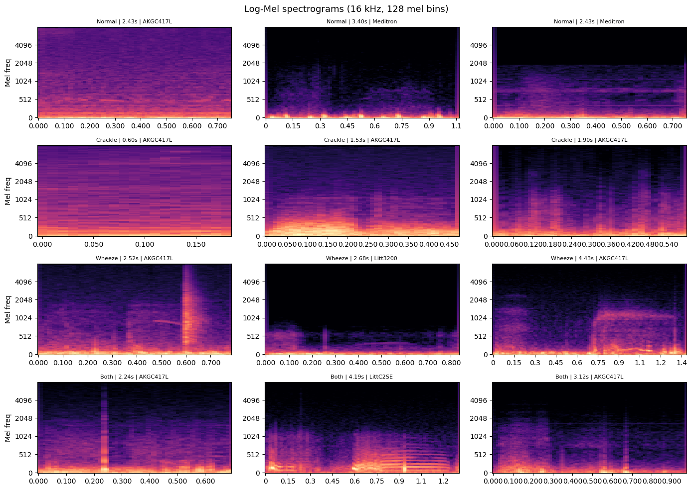

# Respiratory Sound Classification (ICBHI 2017)

## Dataset

**ICBHI 2017** contains 920 recordings from 126 patients, totaling **6898 annotated respiratory cycles** labeled as one of four classes:

| Class | Count |
|-------|-------|
| Normal | 3642 |
| Crackle | 1864 |
| Wheeze | 886 |
| Both | 506 |

Each cycle is segmented from `.wav` files using paired `.txt` annotations (start/end timestamps), resampled to 16 kHz, and cyclically padded to exactly 8 seconds (128000 samples). The official patient-disjoint 60/40 train/test split from `train_test.txt` is used throughout.



---

## Pipeline



The cache (preprocessed tensors) is built once by `notebooks/02_preprocess.ipynb` and reused across all experiments.

---

## Methods

### Baseline: AST + SAM + WRS

- **Backbone**: Audio Spectrogram Transformer ([AST](https://arxiv.org/abs/2104.01778)) initialized from `MIT/ast-finetuned-audioset-10-10-0.4593` (86M parameters), 527-class head replaced with a 4-class linear head.
- **Optimizer**: [SAM](https://arxiv.org/abs/2010.01412) (Sharpness-Aware Minimization, rho=0.05) wrapping AdamW (lr=1e-5, wd=1e-4). SAM runs two forward/backward passes per step: one to compute the gradient, one at the perturbed weights, then restores and updates.
- **Sampler**: WeightedRandomSampler with inverse-frequency class weights, equalising class exposure per epoch.
- **Config**: batch=8, epochs=10, seed=17.



---

### Improvement 1: SpecAugment + Label Smoothing

- **SpecAugment** ([Park et al., 2019](https://arxiv.org/abs/1904.08779)): 2 time masks (max 80 frames) + 2 frequency masks (max 27 bins) applied to log-Mel spectrograms during training, filled with the spectrogram mean.
- **Label smoothing**: epsilon=0.1, softens CrossEntropyLoss targets to prevent overconfidence.
- Same backbone, optimizer, and sampler as baseline.
- **Config**: batch=8, epochs=5, seed=17.



---

### Improvement 2: CNN14 (PANNs)

- **Backbone**: [CNN14](https://arxiv.org/abs/1912.10211) (14-layer CNN from PANNs, pretrained on AudioSet via `panns-inference`), 527-class AudioSet head replaced with a 4-class head.
- Takes raw waveforms as input (128000 samples); internal log-Mel computation handled by the backbone.
- Same SAM optimizer and WeightedRandomSampler as baseline.
- **Config**: batch=32, epochs=20, lr=1e-4, label_smoothing=0.1.



---

## Results

Evaluation follows the **official ICBHI binary protocol**: any abnormal-class prediction on an abnormal ground-truth sample counts as correct (intra-abnormal confusion, e.g., Crackle predicted as Wheeze, is not penalized).

- **Se** = correct abnormal / total abnormal
- **Sp** = correct normal / total normal
- **Score** = (Se + Sp) / 2

| Model | Se (%) | Sp (%) | Score (%) |
|-------|--------|--------|-----------|
| Reference paper (Isik et al., 2024) | 68.31 | 67.89 | 68.10 |
| **AST + SAM + WRS (baseline)** | **54.46** | **82.84** | **68.65** |
| AST + SpecAugment + Label Smoothing | 71.11 | 57.69 | 64.40 |
| CNN14 (PANNs) + SAM + WRS | 68.90 | 57.69 | 63.30 |

> Score is (Se + Sp) / 2. **Sensitivity (Se) is the primary clinical metric**, false negatives have worse consequences than false positives in respiratory diagnosis.

---

## Spectrogram Examples

Sample log-Mel spectrograms per class (Normal, Crackle, Wheeze, Both):



---

## Repository Layout

```
project/
├── src/
│   ├── data/               # preprocessing.py, splits.py, icbhi_dataset.py, waveform_dataset.py
│   ├── models/             # ast_model.py, cnn14_model.py
│   ├── training/           # train_loop.py, sam.py, sampler.py
│   ├── augment/            # specaugment.py
│   └── eval/               # metrics.py
├── configs/                # baseline.yaml, specaugment.yaml, cnn14.yaml, smoke.yaml
├── notebooks/
│   ├── 01_data_audit.ipynb
│   ├── 02_preprocess.ipynb
│   ├── 03_train_baseline.ipynb
│   ├── 04a_exp_specaugment_kaggle.ipynb
│   └── 04b_exp_cnn14_kaggle.ipynb
├── scripts/                # preprocess.py, train.py
└── report/                 # Typst academic report
```

## Setup

```bash
# Install dependencies (requires uv)
uv sync

# Preprocess dataset (one-time, requires ICBHI data in data/icbhi/)
uv run python scripts/preprocess.py --out data/cache/icbhi_16k_8s.pt

# Smoke test (CPU, tiny subset)
uv run python scripts/train.py --config configs/smoke.yaml

# Full training
uv run python scripts/train.py --config configs/baseline.yaml
```

For cloud training, use the Kaggle notebooks in `notebooks/` which handle dataset download, cache loading, and checkpoint saving automatically.

---

## References

- Isik et al. (2024) — [Geometry-Aware Optimization for Respiratory Sound Classification](https://arxiv.org/abs/2512.22564)
- Gong et al. (2021) — [AST: Audio Spectrogram Transformer](https://arxiv.org/abs/2104.01778)
- Kong et al. (2020) — [PANNs: Large-Scale Pretrained Audio Neural Networks](https://arxiv.org/abs/1912.10211)
- Foret et al. (2021) — [Sharpness-Aware Minimization (SAM)](https://arxiv.org/abs/2010.01412)
- Park et al. (2019) — [SpecAugment](https://arxiv.org/abs/1904.08779)
- Rocha et al. (2019) — [ICBHI 2017 Dataset](https://iopscience.iop.org/article/10.1088/1361-6579/ab03ea)
